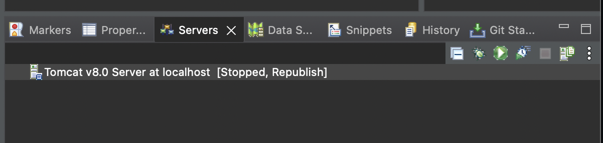
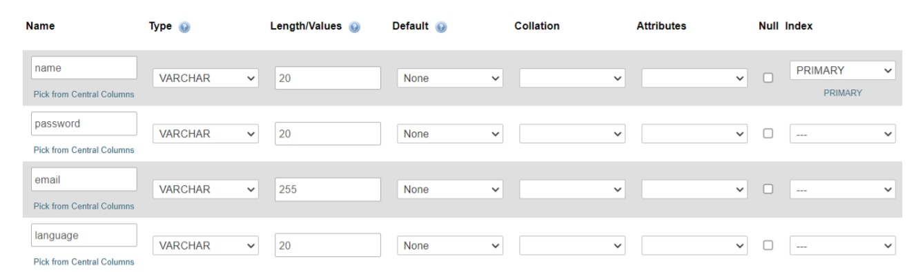

# DevopS
This project is a creation of user management system using Eclipse IDE dynamic web project with tomcat server to do all the CRUD requests

# Prerequisite

 - Xampp software Installed in your computer. (https://www.apachefriends.org/download.html)
 - Eclipse IDE for Enterprise Java and Web Developers (https://www.eclipse.org/downloads/packages/)
 - Apache Tomcat Server v8.0.9 Installed 
 - Github Account 

## Installation & Set Up

**1. To create a local copy in your computer, we will guide you on how to clone this repository.**

To clone the repository using HTTPS, under "Clone with HTTPS," click the copy button to copy the URL of the remote Git Repository.

Launch & Navigate to your Eclipse IDE, Go to File -> Import -> Projects from Git -> Clone URI -> paste the URI there or it is automatically pasted for you -> Add in your authentication details -> Click 'Next'-> Click 'Using existing project' -> then finish. 

Once you see the DevopS project in your project explorer, then it means you have successfully cloned the repo.

**2. Setting Up Xampp & Tomcat Server**

Make sure Xampp is installed in your local device.
Once you have extracted the zip file and installed Tomcat Server, navigate back to Eclipse IDE. 
Go to show window -> servers -> servers menu is shown.
At the moment , you will see "no servers shown". Click the blue link. 
Under Apache, choose Tomcat v8.0, go next,
Then browse to the folder you installed your tomcat.
Click finish. You have finally got up your server ready.It should look like this:

Now drag the project into the server,and you should see the DevopS under the server

**3. Setting Up User Table in Xampp**

Start Apache, MySQL, click Admin to open up PHPMYADMIN
1. Change our root user password 
 To create root password in PHPMyAdmin in UI easy way, you can follow simple steps below:
 Access phpMyAdmin with root account (no password) -> User accounts.
 Click on root > Edit privileges, Then click on Change password
 Change to 'password'
 In order to allow access to phpmyadmin page again, configure the phpmyadmin default password. 
 Select config > phpMyAdmin (config.inc.php) -> change '' for password to 'password' and save.

2. Create Userdetails database with 4 columns
Configure such that it looks like this: 
Database name : UserDetails

## Start Server 
Right click on server, click start.
Go to this url : http://localhost:8090/DevopS/UserServlet/dashboard

## Contents of this Project
This project shows a simple user management system that can do all the CRUD requests with source versioning tools to sub collaborate with team members.
We have created some branches to update our progress into the project. This helped to easen the confusion and solve conflicts easily and solve the bugs when new features are added into the github repository.

## Contributions
- @tayweilong created the edit user form with update user functionality
- @jyorien created the user management system display with retrieve user functionality 
- @wenhuibbb added the delete user functionality for the system
- @hhafzahh added the register user form with add user functionality 

